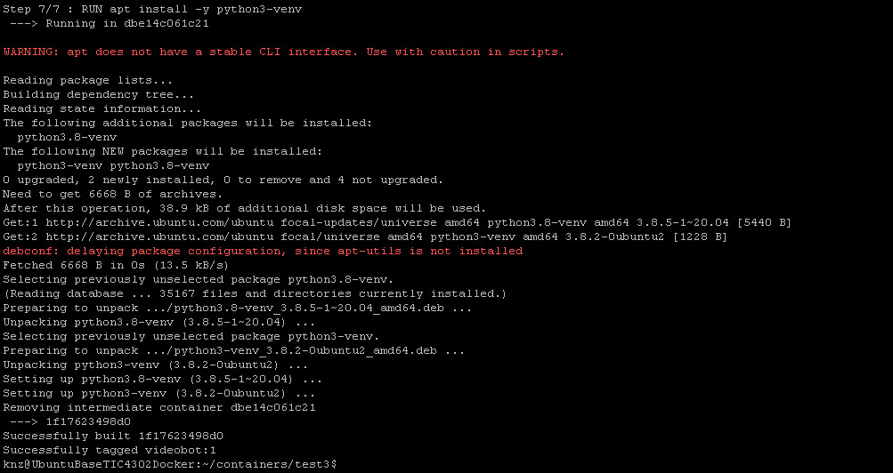
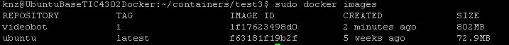

## Testing Plan for Video Streaming Bot

Ensure environment is setup with ubuntu 20.04 and Python3.8 is installed including the relevant python packages. Below steps are pre-requisites to install Python3 on Ubuntu. Follow each of the steps below

- sudo apt-get install software-properties-common

- sudo add-apt-repository ppa:deadsnakes/ppa

- sudo apt-get update

- sudo apt-get install python3.8

- sudo apt install -y python3-pip

- sudo apt install -y build-essential libssl-dev libffi-dev python3-dev

- sudo apt install -y python3-venv

  

#### Test Case:  01 - Docker Testing

Description: To test creation of the docker
Perform the following to create a docker

- Clone the repository: git clone https://github.com/TIC4302/video-streaming-bot.git

- execute and run: sudo docker build . -t videobot:1

  output:

  Sending build context to Docker daemon  4.608kB
  Step 1/7 : FROM ubuntu:latest
  latest: Pulling from library/ubuntu
  83ee3a23efb7: Pull complete
  db98fc6f11f0: Pull complete
  f611acd52c6c: Pull complete
  Digest: sha256:703218c0465075f4425e58fac086e09e1de5c340b12976ab9eb8ad26615c3715
  Status: Downloaded newer image for ubuntu:latest
   ---> f63181f19b2f
  Step 2/7 : RUN apt-get update && apt-get install firefox -y && apt-get install xauth -y
   ---> Running in 9c4b79c91d88
  Get:1 http://security.ubuntu.com/ubuntu focal-security InRelease [109 kB]
  Get:2 http://archive.ubuntu.com/ubuntu focal InRelease [265 kB]
  Get:3 http://security.ubuntu.com/ubuntu focal-security/universe amd64 Packages [670 kB]

  .....

  Fetched 6668 B in 0s (13.5 kB/s)
  Selecting previously unselected package python3.8-venv.
  (Reading database ... 35167 files and directories currently installed.)
  Preparing to unpack .../python3.8-venv_3.8.5-1~20.04_amd64.deb ...
  Unpacking python3.8-venv (3.8.5-1~20.04) ...
  Selecting previously unselected package python3-venv.
  Preparing to unpack .../python3-venv_3.8.2-0ubuntu2_amd64.deb ...
  Unpacking python3-venv (3.8.2-0ubuntu2) ...
  Setting up python3.8-venv (3.8.5-1~20.04) ...
  Setting up python3-venv (3.8.2-0ubuntu2) ...
  Removing intermediate container dbe14c061c21
   ---> 1f17623498d0
  Successfully built 1f17623498d0
  Successfully tagged videobot:1

  
  
- run sudo docker images

  

- docker image name videobot with version/tag 1 is created
- to run the newly built docker, execute the following command: sudo docker run -it --rm videobot:1 bash

